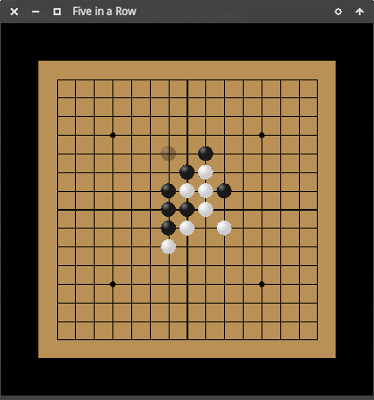

# Endless Five-In-a-Row Game（五子棋無盡版）

## Rules

Two players take turns to place a piece on a board. When you got five pieces

- in a row,
- in a column,
- or in a diagonal line,

(it is called a *Five-In-a-Row (FIR)*),
these five pieces will be removed and you will get a bonus turn, where:

- you can place a piece of your own at any **blank** place,
- you can **eat** one piece of your opponent, and place your own one at the same 
  place.
  
In your bonus turn if you get another FIR, you will get one more bonus turn, etc.

## 規則

兩人輪流落子，當出現同一行、同一列、同一對角線上五子相連時，五子將被移除，同時將獲得額外的獎勵輪次。

獎勵輪次中，除常規落子外，還可「吃掉」對手一子，據爲己有。若獎勵輪次中再次出現五子相連，則繼續
額外獲得一輪獎勵輪次，直到不出現五子相連爲止。
